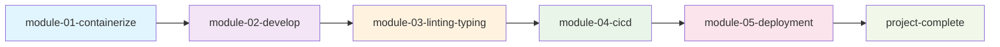

# 🔄 Flujo de Aprendizaje Modular

Este repositorio está organizado con **ramas modulares** que representan diferentes etapas del aprendizaje de Docker con Python.

## 📋 Estructura de Ramas Principal

### 📚 **Módulos de Aprendizaje Secuencial**

Cada módulo representa un nivel específico de conocimiento y habilidades:

### 🐳 **module-01-containerize**

```bash
git checkout module-01-containerize
```

**Estado:** Aprende containerización básica

- ✅ Conceptos fundamentales de Docker
- ✅ Creación de Dockerfiles
- ✅ Build y run de contenedores
- 🎯 **Fundamentos de Docker**

---

### 🔧 **module-02-develop**

```bash
git checkout module-02-develop
```

**Estado:** Desarrollo local con Docker

- ✅ Docker Compose multi-servicios
- ✅ Hot reload y debugging
- ✅ Integración con bases de datos
- 🎯 **Desarrollo eficiente**

---

### ✨ **module-03-linting-typing**

```bash
git checkout module-03-linting-typing
```

**Estado:** Calidad de código

- ✅ Linting con Black, Flake8
- ✅ Type checking con mypy
- ✅ Pre-commit hooks
- 🎯 **Código de calidad**

---

### 🚀 **module-04-cicd**

```bash
git checkout module-04-cicd
```

**Estado:** CI/CD Pipeline

- ✅ GitHub Actions workflows
- ✅ Testing automatizado
- ✅ Build y push automático
- � **Automatización completa**

---

### 🏗️ **module-05-deployment**

```bash
git checkout module-05-deployment
```

**Estado:** Deployment y testing

- ✅ Kubernetes local
- ✅ Manifiestos YAML
- ✅ Testing de deployment
- 🎯 **Production ready**

---

### 🏆 **project-complete**

```bash
git checkout project-complete
```

**Estado:** Proyecto final completo

- ✅ Todas las configuraciones optimizadas
- ✅ Mejores prácticas implementadas
- ✅ Listo para producción
- 🎯 **Referencia final**

## 🎓 Flujo de Aprendizaje Recomendado



### Progresión Paso a Paso

#### **Nivel 1: Fundamentos**

```bash
git checkout module-01-containerize
# Aprende los conceptos básicos de Docker
```

#### **Nivel 2: Desarrollo**

```bash
git checkout module-02-develop
# Domina el desarrollo local con Docker
```

#### **Nivel 3: Calidad**

```bash
git checkout module-03-linting-typing
# Implementa mejores prácticas de código
```

#### **Nivel 4: Automatización**

```bash
git checkout module-04-cicd
# Configura CI/CD completo
```

#### **Nivel 5: Deployment**

```bash
git checkout module-05-deployment
# Deploy y testing en Kubernetes
```

#### **Nivel Final: Proyecto Completo**

```bash
git checkout project-complete
# Referencia del proyecto final optimizado
```

## 🛠️ Ramas de Desarrollo (Opcionales)

Además de las 3 ramas principales, existen ramas de módulos específicos:

- `module-01-containerize` - Desarrollo del Módulo 1
- `module-02-develop` - Desarrollo del Módulo 2
- `module-03-linting-typing` - Linting y tipado
- `module-04-cicd` - CI/CD pipelines
- `module-05-deployment` - Deployment strategies

## 📝 Comandos Útiles

### Ver todas las ramas

```bash
git branch -a
```

### Cambiar entre ramas principales

```bash
# Punto de partida
git checkout starter-clean

# Módulo 1 completado
git checkout module-01-complete

# Proyecto completo
git checkout project-complete
```

### Comparar ramas

```bash
# Ver diferencias entre starter y complete
git diff starter-clean..module-01-complete

# Ver diferencias entre module-01 y final
git diff module-01-complete..project-complete
```

## 🎯 Objetivo del Flujo

Este flujo te permite:

1. **Empezar limpio** sin configuraciones Docker
2. **Validar tu progreso** comparando con la rama completada
3. **Ver el resultado final** optimizado para producción
4. **Aprender gradualmente** sin sentirte abrumado

¡Disfruta aprendiendo Docker paso a paso! 🐳
