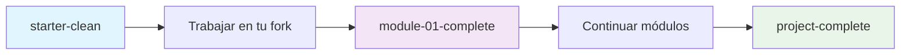

# 🔄 Flujo de Aprendizaje con Ramas

Este repositorio está organizado en **3 ramas principales** que representan diferentes etapas del aprendizaje de Docker con Python.

## 📋 Estructura de Ramas

### 🌱 **starter-clean**
```bash
git checkout starter-clean
```
**Estado:** Código Python sin Docker
- ✅ Aplicaciones Flask y FastAPI funcionales
- ❌ Sin archivos Docker (Dockerfile, compose.yaml)
- 🎯 **Punto de partida** para aprender Docker desde cero

**¿Cuándo usar esta rama?**
- Cuando quieres empezar desde el principio
- Para entender cómo era el proyecto antes de Docker
- Como base para practicar containerización

---

### 🎯 **module-01-complete**
```bash
git checkout module-01-complete
```
**Estado:** Módulo 1 completado exitosamente
- ✅ Aplicaciones containerizadas con Docker
- ✅ Dockerfiles básicos funcionando
- ✅ Docker Compose configurado
- 🎉 **Celebración del primer logro**

**¿Cuándo usar esta rama?**
- Después de completar el Módulo 1
- Para validar que tus resultados coinciden
- Como punto de partida para Módulo 2

---

### 🚀 **project-complete**
```bash
git checkout project-complete
```
**Estado:** Proyecto final con todas las configuraciones
- ✅ Dockerfiles optimizados para producción
- ✅ Configuraciones de seguridad avanzadas
- ✅ Multi-stage builds implementados
- ✅ Redes y volúmenes Docker configurados
- 🏆 **Proyecto listo para producción**

**¿Cuándo usar esta rama?**
- Como referencia del estado final
- Para deployments en producción
- Como ejemplo de mejores prácticas

## 🎓 Flujo de Aprendizaje Recomendado


```mermaid
graph LR
    A[starter-clean] --> B[Trabajar en tu fork]
    B --> C[module-01-complete]
    C --> D[Continuar módulos]
    D --> E[project-complete]
    
    style A fill:#e1f5fe
    style C fill:#f3e5f5
    style E fill:#e8f5e8
```

### Paso 1: Comenzar
```bash
git checkout starter-clean
# Aquí tienes código Python sin Docker
```

### Paso 2: Aprender y practicar
- Sigue el tutorial del Módulo 1
- Crea tus propios Dockerfiles
- Experimenta con Docker Compose

### Paso 3: Validar progreso
```bash
git checkout module-01-complete
# Compara tus resultados con esta rama
```

### Paso 4: Referencia final
```bash
git checkout project-complete
# Ve el estado final optimizado
```

## 🛠️ Ramas de Desarrollo (Opcionales)

Además de las 3 ramas principales, existen ramas de módulos específicos:

- `module-01-containerize` - Desarrollo del Módulo 1
- `module-02-develop` - Desarrollo del Módulo 2
- `module-03-linting-typing` - Linting y tipado
- `module-04-cicd` - CI/CD pipelines
- `module-05-deployment` - Deployment strategies

## 📝 Comandos Útiles

### Ver todas las ramas
```bash
git branch -a
```

### Cambiar entre ramas principales
```bash
# Punto de partida
git checkout starter-clean

# Módulo 1 completado
git checkout module-01-complete

# Proyecto completo
git checkout project-complete
```

### Comparar ramas
```bash
# Ver diferencias entre starter y complete
git diff starter-clean..module-01-complete

# Ver diferencias entre module-01 y final
git diff module-01-complete..project-complete
```

## 🎯 Objetivo del Flujo

Este flujo te permite:
1. **Empezar limpio** sin configuraciones Docker
2. **Validar tu progreso** comparando con la rama completada
3. **Ver el resultado final** optimizado para producción
4. **Aprender gradualmente** sin sentirte abrumado

¡Disfruta aprendiendo Docker paso a paso! 🐳
